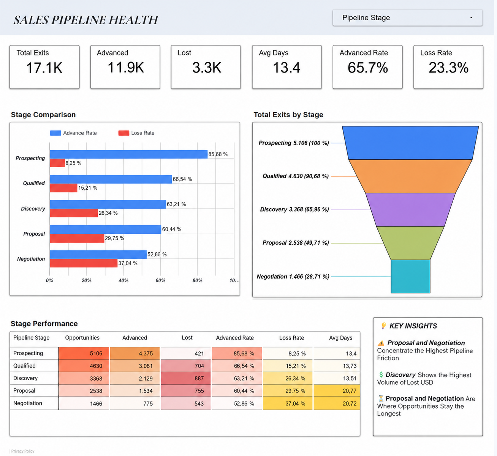
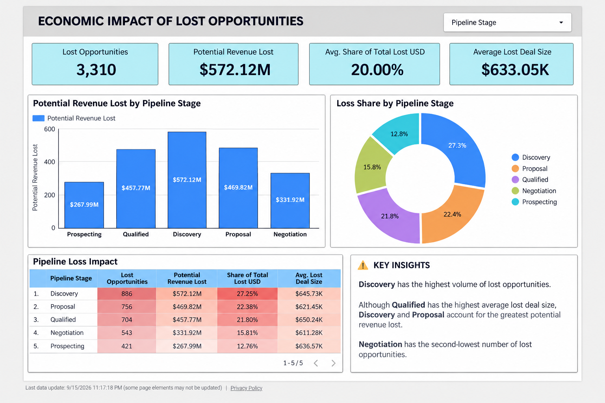
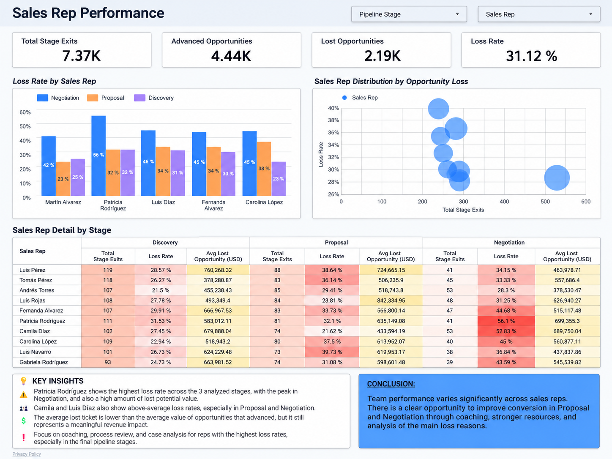

# Sales Pipeline Health Analysis

### Identifying where opportunities are lost, how much pipeline value is at risk, and which parts of the sales process require attention.

[Versión en Español](README.md) 

---

## The Business Problem

The Sales Manager had a concern:

> **“We are generating opportunities, but too many of them are failing to convert into sales. I need to understand where the process is breaking down and what we should improve.”**

The goal of this analysis was not simply to count Won and Lost opportunities.

We needed to understand:

- where the sales process slows down;
- which stages generate the most losses;
- where the greatest amount of potential pipeline value is at risk;
- and whether some sales representatives show significantly higher loss rates than the rest of the team.

The main business question was:

> **Where are we losing opportunities within the sales pipeline, and what is the business impact of those losses?**

---

# The Sales Process

Before analyzing performance, it was necessary to understand the company's official sales pipeline.

```text
Prospecting
    ↓
Qualified
    ↓
Discovery
    ↓
Proposal
    ↓
Negotiation
    ↓
Won
```

An opportunity can become **Lost** from different stages of the process.

The CRM also contains secondary paths such as `Needs Analysis`, as well as stage skips and backward movements.

To evaluate the overall health of the sales process, the main analysis focused first on the official linear pipeline.

---

# Analytical Approach

The analysis was structured around three business questions.

### 1. Where does the pipeline slow down?

I reconstructed the stage history of each opportunity and calculated how long opportunities take to move from one stage to the next.

### 2. Where is the greatest economic risk?

I analyzed opportunities that moved to `Lost` and quantified the potential pipeline value associated with those losses.

### 3. Are there sales representatives who require additional attention?

I compared Loss Rate by sales representative and stage, and then evaluated whether Deal Size could explain some of the observed performance differences.

---

# 1. Pipeline Health



The early stages of the pipeline move at a relatively consistent pace:

| Transition | Average Time |
|---|---:|
| Prospecting → Qualified | 13.40 days |
| Qualified → Discovery | 13.73 days |
| Discovery → Proposal | 13.51 days |
| Proposal → Negotiation | **20.77 days** |
| Negotiation → Won | **20.72 days** |

The pattern changes after `Proposal`.

Opportunities move from approximately **13–14 days per transition** in the early stages to approximately **20–21 days** in the final stages.

At the same time, the Loss Rate increases as opportunities move closer to closing:

| Stage | Advance Rate | Loss Rate |
|---|---:|---:|
| Prospecting | 85.70% | 8.25% |
| Qualified | 66.54% | 15.21% |
| Discovery | 63.21% | 26.31% |
| Proposal | 60.44% | 29.79% |
| Negotiation | 52.86% | **37.04%** |

### Key Finding

> **The pipeline becomes slower and less efficient as opportunities move closer to closing.**

`Negotiation` has the highest Loss Rate in the process, while `Proposal → Negotiation` represents the first significant increase in transition time.

---

# 2. Pipeline Value at Risk

Knowing where the highest number of opportunities is lost is not enough.

We also need to understand:

> **Where do those losses create the greatest economic impact?**



The results show:

| Stage Before Lost | Potential Pipeline Value Lost | % of Total |
|---|---:|---:|
| Discovery | **$572.12M** | **27.25%** |
| Proposal | $469.82M | 22.38% |
| Qualified | $457.77M | 21.80% |
| Negotiation | $331.92M | 15.81% |
| Prospecting | $267.99M | 12.76% |

### Key Finding

Although `Negotiation` has the highest Loss Rate, **Discovery represents the largest amount of potential pipeline value lost**.

This happens because many opportunities leave the pipeline before reaching the final stages.

> **The stage with the highest loss rate is not necessarily the stage with the greatest economic impact.**

This distinction matters because it changes where the Sales Manager should prioritize resources and process improvements.

---

# 3. Sales Team Performance

After identifying where the main pipeline leaks occur, I analyzed whether the problem was evenly distributed across the sales team.



To avoid unfair comparisons, performance was not evaluated only by the number of lost opportunities.

Instead, I calculated:

> **Loss Rate by sales representative and pipeline stage**

while also applying a minimum opportunity volume to reduce the impact of small samples.

Several representatives appeared repeatedly among the highest Loss Rates in critical stages.

For example:

### Patricia Rodríguez

- Discovery Loss Rate: **31.53%**
- Negotiation Loss Rate: **56.10%**

The overall Negotiation Loss Rate was approximately **37%**, making this difference worth investigating.

### Camila Díaz

- Negotiation Loss Rate: **52.83%**

This is also considerably above the overall team behavior in the same stage.

---

# Does Deal Size Explain the Difference?

Before concluding that a sales representative had a performance problem, I tested another possible explanation:

> **Are representatives with higher Loss Rates managing larger and potentially more difficult opportunities?**

To evaluate this, I compared:

- Average Lost Deal Size
- Average Advanced Deal Size

The results showed different patterns across representatives.

For some sales reps, lost opportunities were significantly larger than the opportunities they successfully advanced.

For others, the difference was minimal.

For example, Patricia Rodríguez in Negotiation:

- Average Lost Deal: approximately **$699K**
- Average Advanced Deal: approximately **$693K**

The difference is very small.

### Key Finding

> **Deal Size may explain part of the risk for some representatives, but it does not explain the team's conversion differences by itself.**

For cases such as Patricia Rodríguez or Camila Díaz, the elevated Loss Rate should be investigated beyond the size of the opportunities assigned to them.

---

# Key Findings

The analysis identified four important signals.

### 1. The pipeline slows down in the final stages

Early-stage transitions take approximately **13–14 days**, while Proposal and Negotiation require approximately **20–21 days**.

### 2. Negotiation has the highest Loss Rate

Approximately **37.04%** of opportunities leaving Negotiation move directly to Lost.

### 3. Discovery has the greatest economic impact

Discovery represents approximately **$572.1M in potential pipeline value lost**, or **27.25% of the total analyzed**.

### 4. Sales performance is not uniform across the team

Some representatives show consistently higher Loss Rates than the general team behavior, even after considering Deal Size.

---

# Business Recommendations

## 1. Strengthen Discovery

Discovery represents the largest amount of potential pipeline value lost.

The sales team should review:

- quality of identified customer needs;
- urgency of the problem;
- stakeholders involved in the buying process;
- qualification criteria before moving an opportunity to Proposal.

**Objective:** avoid investing additional sales resources in opportunities that are not sufficiently mature.

---

## 2. Standardize Negotiation

Negotiation combines:

- the highest Loss Rate;
- longer transition times;
- and proximity to closing.

Recommended actions include:

- negotiation checklist;
- mandatory follow-up process;
- discount guidelines;
- objection review;
- alerts for stalled opportunities.

**Objective:** improve the `Negotiation → Won` conversion rate.

---

## 3. Implement Targeted Coaching

Not every sales representative shows the same performance pattern.

Instead of applying the same training to the entire team, coaching should prioritize representatives with persistent deviations from the team benchmark.

The goal is not to assume poor performance automatically.

The review should investigate factors such as:

- follow-up process;
- objection handling;
- negotiation;
- pricing;
- characteristics of the opportunities assigned.

---

## 4. Monitor Pipeline Health Continuously

The Sales Manager should regularly monitor metrics such as:

- Advance Rate by stage
- Loss Rate by stage
- Average / Median Time in Stage
- Pipeline Value Lost
- Loss Rate by Sales Rep
- Deal Size
- Stalled Opportunities

This makes it possible to identify friction before it appears only as a lost sale.

---

# Business Outcome

The initial problem was:

> **“We are losing too many opportunities. Where is the process failing?”**

The analysis transformed that broad concern into a more specific diagnosis:

> **The greatest friction appears in the final stages of the pipeline, where both transition time and loss rates increase. However, the largest economic impact occurs earlier, especially in Discovery. In addition, some sales representatives show above-average loss rates that cannot be explained by Deal Size alone.**

This gives the Sales Manager a clearer set of priorities:

- improve Discovery quality;
- strengthen the Negotiation process;
- investigate specific sales representatives;
- and monitor pipeline health with operational KPIs.

---

# Data Quality Considerations

Several data quality issues were identified during the analysis.

These included:

- inconsistent stage labels such as `Prospect` and `Prospecting`;
- non-linear sales paths;
- opportunities without stage history;
- separate date and time fields that required normalization.

A total of **120 opportunities** were present in the `opportunities` table without corresponding records in `opportunity_stage_history`.

Because their movement through the pipeline could not be reconstructed, these opportunities were excluded from analyses requiring stage-level traceability.

The **5,200 traceable opportunities** formed the main population used for transition-based analysis.

---

# Technical Implementation

Although the main focus of the project is business decision-making, the analysis required reconstructing the behavior of the pipeline from opportunity-level stage history.

Technical methods used include:

- Data Quality Checks
- SQL Joins
- Common Table Expressions (CTEs)
- Window Functions
- `LEAD()`
- `LAG()`
- `DATEDIFF()`
- `CASE`
- Conditional Aggregation
- Percentiles / Median
- `ROW_NUMBER()`
- Conversion Rate Analysis
- Deal Size Analysis

The complete SQL queries are available in:

```text
/sql
```

---

# Repository Structure

```text
sales-pipeline-health-analysis/
│
├── README.md
├── README.en.md
│
├── sql/
│   ├── 01_validacion_de_datos.sql
│   ├── 02_reconstruccion_del_pipeline.sql
│   ├── 03_salud_del_pipeline.sql
│   ├── 04_valor_en_riesgo.sql
│   └── 05_performance_vendedores.sql
│
├── docs/
│   ├── contexto_del_negocio.md
│   ├── metodologia.md
│   ├── reglas_de_negocio.md
│   └── diccionario_de_datos.md
│
└── images/
    ├── 01_pipeline_health.png
    ├── 02_revenue_at_risk.png
    └── 03_sales_rep_performance.png
```

---

# Tools

- SQL Server
- T-SQL
- Google Sheets
- Looker Studio
- Git
- GitHub

---

# Skills Demonstrated

- Business Analysis
- Data Analysis
- Sales Analytics
- Revenue Operations
- Data Cleaning
- SQL
- KPI Design
- Data Visualization
- Data Storytelling
- Business Recommendations

---

# Author

**Yxel Morillo**

Business Analyst | Data Analyst

GitHub: https://github.com/yxelmorillo
