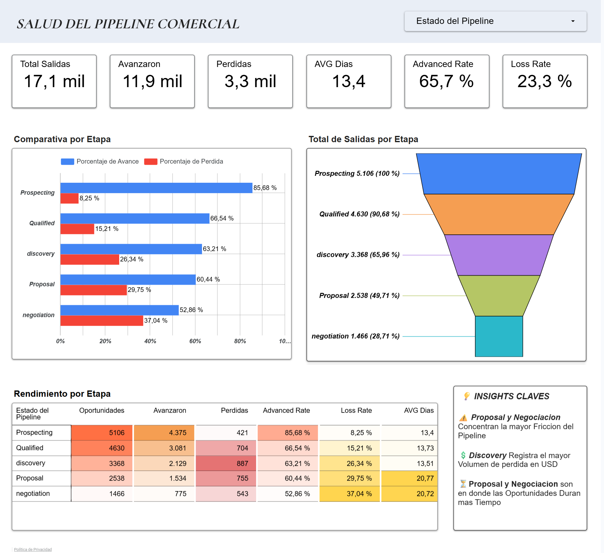
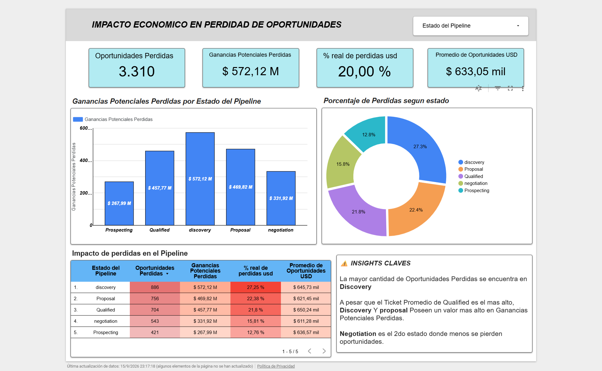
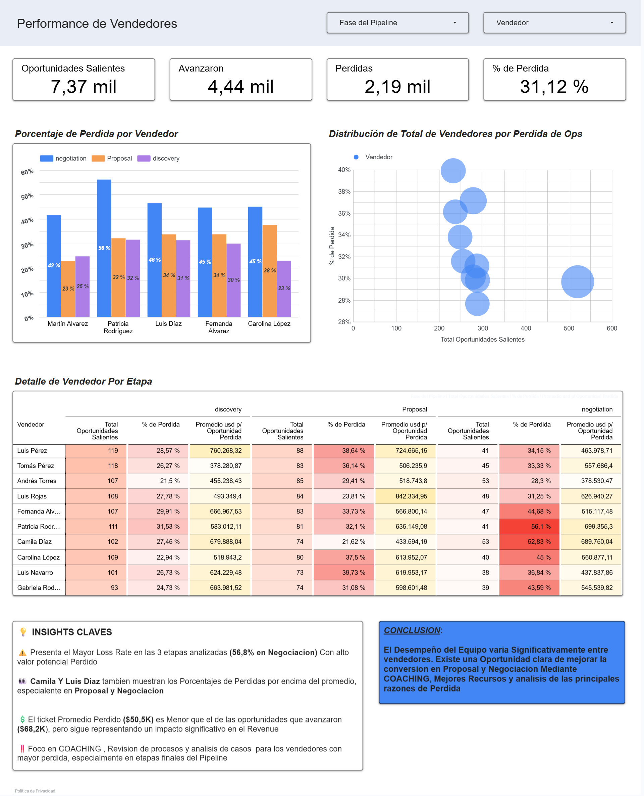

# Análisis de Salud del Pipeline Comercial

### Cómo identificar dónde se pierden oportunidades, cuánto valor está en riesgo y qué partes del proceso comercial requieren intervención.

[English Version](README.en.md)

---

## El problema

El Gerente Comercial tenía una preocupación:

> **“Estamos generando oportunidades, pero siento que estamos perdiendo demasiadas antes de convertirlas en ventas. Necesito saber dónde está fallando el proceso y qué deberíamos corregir.”**

El objetivo del análisis no era simplemente contar oportunidades ganadas y perdidas.

Necesitábamos entender:

- dónde se ralentiza el proceso comercial;
- en qué etapas se pierden más oportunidades;
- dónde se concentra el mayor valor económico en riesgo;
- y si existen vendedores con tasas de pérdida significativamente superiores al resto del equipo.

La pregunta principal del caso fue:

> **¿Dónde estamos perdiendo oportunidades dentro del pipeline comercial y qué impacto tienen esas pérdidas sobre el negocio?**

---

# El proceso comercial

Antes de analizar los resultados fue necesario entender cómo funciona el pipeline oficial de la empresa.

```text
Prospecting
    ↓
Qualified
    ↓
Discovery
    ↓
Proposal
    ↓
Negotiation
    ↓
Won
```

Una oportunidad puede terminar como **Lost** desde distintas etapas del proceso.

También existen algunas rutas secundarias, como `Needs Analysis`, además de saltos y retrocesos entre etapas. Para analizar la salud general del proceso, el estudio se concentró primero en el pipeline principal.

---

# Cómo abordé el análisis

El análisis se dividió en tres preguntas:

### 1. ¿Dónde se ralentiza el pipeline?

Reconstruí el historial de cada oportunidad y calculé cuánto tiempo tarda en avanzar de una etapa a la siguiente.

### 2. ¿Dónde se concentra el mayor riesgo económico?

Analicé las oportunidades que terminaron en `Lost` y cuantifiqué el valor potencial asociado a esas pérdidas.

### 3. ¿Existen vendedores que requieren atención?

Comparé el Loss Rate de cada representante comercial y posteriormente evalué si el tamaño de sus oportunidades podía explicar parte de esas diferencias.

---

# 1. Salud del Pipeline



Las primeras etapas del pipeline muestran un ritmo relativamente estable:

| Transición | Tiempo promedio |
|---|---:|
| Prospecting → Qualified | 13.40 días |
| Qualified → Discovery | 13.73 días |
| Discovery → Proposal | 13.51 días |
| Proposal → Negotiation | **20.77 días** |
| Negotiation → Won | **20.72 días** |

El cambio comienza después de `Proposal`.

Las oportunidades pasan de necesitar aproximadamente **13–14 días** por transición a aproximadamente **20–21 días** en las etapas finales.

Al mismo tiempo, la tasa de pérdida aumenta a medida que las oportunidades avanzan:

| Etapa | Advance Rate | Loss Rate |
|---|---:|---:|
| Prospecting | 85.70% | 8.25% |
| Qualified | 66.54% | 15.21% |
| Discovery | 63.21% | 26.31% |
| Proposal | 60.44% | 29.79% |
| Negotiation | 52.86% | **37.04%** |

### Hallazgo

> **El pipeline se vuelve más lento y menos eficiente a medida que las oportunidades se acercan al cierre.**

`Negotiation` presenta la mayor tasa de pérdida del proceso, mientras que `Proposal → Negotiation` representa el primer aumento significativo en el tiempo necesario para avanzar.

---

# 2. Valor en Riesgo

Saber dónde se pierden más oportunidades no era suficiente.

También necesitábamos responder:

> **¿Dónde esas pérdidas representan mayor impacto económico?**



Los resultados muestran:

| Etapa antes de Lost | Valor potencial perdido | % del total |
|---|---:|---:|
| Discovery | **$572.12M** | **27.25%** |
| Proposal | $469.82M | 22.38% |
| Qualified | $457.77M | 21.80% |
| Negotiation | $331.92M | 15.81% |
| Prospecting | $267.99M | 12.76% |

### Hallazgo

Aunque `Negotiation` tiene el mayor Loss Rate, **Discovery concentra el mayor valor potencial perdido**.

Esto ocurre porque muchas oportunidades abandonan el pipeline antes de llegar a las últimas etapas.

> **La etapa con mayor tasa de pérdida no necesariamente es la etapa con mayor impacto económico.**

Esta diferencia es importante porque cambia dónde debería priorizar sus recursos el Gerente Comercial.

---

# 3. Performance del Equipo Comercial

Después de identificar dónde ocurrían las principales fugas, analicé si el problema estaba distribuido de forma uniforme entre los vendedores.



Para evitar comparaciones injustas, no se utilizó únicamente la cantidad de oportunidades perdidas.

Se calculó el **Loss Rate por vendedor y por etapa**, considerando también un volumen mínimo de oportunidades.

Algunos representantes aparecieron repetidamente entre los mayores Loss Rates en etapas importantes del pipeline.

Por ejemplo:

### Patricia Rodríguez

- Discovery Loss Rate: **31.53%**
- Negotiation Loss Rate: **56.10%**

El promedio general de Negotiation era aproximadamente **37%**, por lo que la diferencia requería investigación.

### Camila Díaz

- Negotiation Loss Rate: **52.83%**

También considerablemente por encima del comportamiento general del equipo.

---

# ¿El tamaño del deal explica las diferencias?

Antes de concluir que un vendedor tenía problemas de gestión, analicé una posible explicación:

> **¿Los vendedores con mayor Loss Rate reciben oportunidades más grandes y difíciles de cerrar?**

Para ello comparé:

- Average Lost Deal Size
- Average Advanced Deal Size

Los resultados mostraron comportamientos distintos.

En algunos vendedores, las oportunidades perdidas eran considerablemente mayores que las oportunidades que lograban avanzar.

En otros, la diferencia era mínima.

Por ejemplo, para Patricia Rodríguez en Negotiation:

- Average Lost Deal: aproximadamente **$699K**
- Average Advanced Deal: aproximadamente **$693K**

La diferencia es muy pequeña.

### Hallazgo

> **El tamaño del deal puede explicar parte del riesgo para algunos vendedores, pero no explica por sí solo las diferencias de conversión del equipo.**

En casos como Patricia Rodríguez o Camila Díaz, el elevado Loss Rate merece una revisión del proceso comercial más allá del tamaño de las oportunidades asignadas.

---

# Principales Hallazgos

El análisis permitió identificar cuatro señales importantes:

**1. El pipeline se ralentiza en las etapas finales.**  
Las primeras transiciones tardan aproximadamente 13–14 días, mientras que Proposal y Negotiation requieren alrededor de 20–21 días.

**2. Negotiation tiene el mayor Loss Rate.**  
El 37.04% de las oportunidades que salen de esta etapa terminan directamente como Lost.

**3. Discovery concentra el mayor impacto económico.**  
Representa aproximadamente $57.2M de pipeline potencial perdido.

**4. El desempeño no es uniforme entre vendedores.**  
Algunos representantes presentan Loss Rates persistentemente superiores al comportamiento general del equipo, incluso después de considerar el tamaño de sus oportunidades.

---

# Recomendaciones de Negocio

## 1. Reforzar Discovery

Discovery concentra el mayor valor potencial perdido.

Se recomienda revisar:

- calidad de las necesidades identificadas;
- urgencia real del cliente;
- stakeholders involucrados;
- criterios utilizados antes de avanzar hacia Proposal.

**Objetivo:** evitar invertir recursos comerciales en oportunidades que todavía no están suficientemente maduras.

---

## 2. Estandarizar Negotiation

Negotiation combina:

- el mayor Loss Rate;
- tiempos elevados;
- y una posición muy cercana al cierre.

Se recomienda establecer:

- checklist de negociación;
- seguimiento obligatorio;
- criterios de descuentos;
- revisión de objeciones;
- alertas para oportunidades estancadas.

**Objetivo:** aumentar la conversión `Negotiation → Won`.

---

## 3. Implementar coaching dirigido

No todos los vendedores presentan los mismos problemas.

En lugar de realizar capacitación general para todo el equipo, se recomienda priorizar representantes con desviaciones persistentes respecto al promedio.

El objetivo no es asumir automáticamente un problema de desempeño, sino investigar:

- seguimiento;
- manejo de objeciones;
- negociación;
- pricing;
- características de las oportunidades asignadas.

---

## 4. Monitorear la salud del pipeline

Se recomienda incorporar regularmente métricas como:

- Advance Rate por etapa
- Loss Rate por etapa
- Average / Median Time in Stage
- Pipeline Value Lost
- Loss Rate por vendedor
- Deal Size
- oportunidades estancadas

Esto permite detectar fricción antes de que aparezca únicamente como una venta perdida.

---

# Resultado del Análisis

El problema inicial era:

> **“Estamos perdiendo demasiadas oportunidades. ¿Dónde está fallando el proceso?”**

El análisis permitió convertir esa preocupación en una respuesta más específica:

> **La mayor fricción aparece en las últimas etapas del pipeline, donde aumentan tanto los tiempos como las tasas de pérdida. Sin embargo, el mayor impacto económico se concentra anteriormente, especialmente en Discovery. Además, algunos vendedores presentan pérdidas superiores al promedio que no pueden explicarse únicamente por el tamaño de sus oportunidades.**

Esto permite al Gerente Comercial pasar de una preocupación general a un conjunto concreto de áreas de intervención.

---

# Consideraciones de Calidad de Datos

Durante el análisis también se identificaron inconsistencias relevantes.

Entre ellas:

- etiquetas inconsistentes como `Prospect` y `Prospecting`;
- rutas comerciales no lineales;
- oportunidades sin historial de etapas;
- registros que requerían normalización de fecha y hora.

Se identificaron **120 oportunidades presentes en `opportunities` sin historial correspondiente en `opportunity_stage_history`**.

Debido a la falta de trazabilidad, estas oportunidades fueron excluidas de los análisis que requerían reconstruir el movimiento dentro del pipeline.

Las **5,200 oportunidades trazables** constituyeron la base principal del análisis de transiciones.

---

# Implementación Técnica

Aunque el foco principal del proyecto es la toma de decisiones de negocio, el análisis requirió reconstruir el comportamiento del pipeline a partir del historial de cada oportunidad.

Entre las técnicas utilizadas se encuentran:

- Data Quality Checks
- SQL Joins
- CTEs
- Window Functions
- `LEAD()`
- `LAG()`
- `DATEDIFF()`
- `CASE`
- Conditional Aggregation
- Percentiles / Median
- Ranking con `ROW_NUMBER()`
- análisis de tasas de conversión
- análisis de Deal Size

Las consultas completas se encuentran en la carpeta:

```text
/sql
```

---

# Estructura del Repositorio

```text
sales-pipeline-health-analysis/
│
├── README.md
├── README.en.md
│
├── sql/
│   ├── 01_validacion_de_datos.sql
│   ├── 02_reconstruccion_del_pipeline.sql
│   ├── 03_salud_del_pipeline.sql
│   ├── 04_valor_en_riesgo.sql
│   └── 05_performance_vendedores.sql
│
├── docs/
│   ├── contexto_del_negocio.md
│   ├── metodologia.md
│   ├── reglas_de_negocio.md
│   └── diccionario_de_datos.md
│
└── images/
    ├── 01_pipeline_health.png
    ├── 02_revenue_at_risk.png
    └── 03_sales_rep_performance.png
```

---

# Herramientas

- SQL Server
- T-SQL
- Google Sheets
- Looker Studio
- Git
- GitHub

---

# Habilidades Demostradas

- Business Analysis
- Data Analysis
- Sales Analytics
- Revenue Operations
- Data Cleaning
- SQL
- KPI Design
- Data Visualization
- Storytelling con datos
- Comunicación de recomendaciones de negocio

---

# Autor

**Yxel Morillo**

Business Analyst | Data Analyst

GitHub: https://github.com/yxelmorillo
